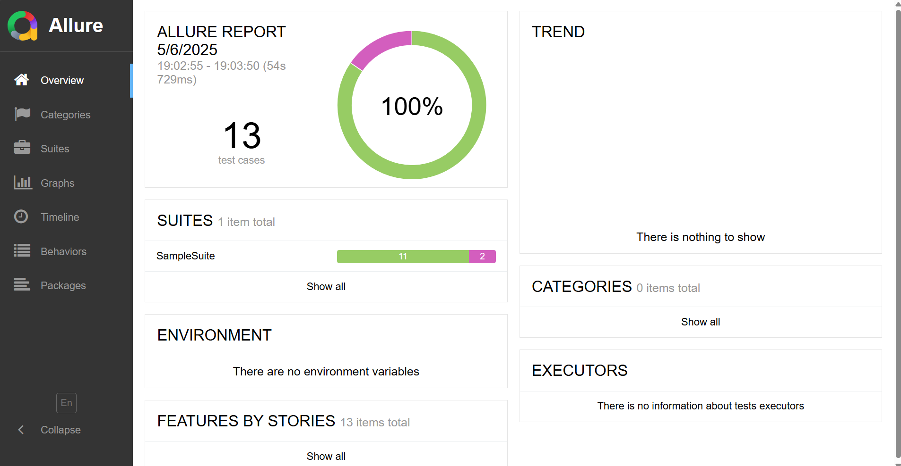
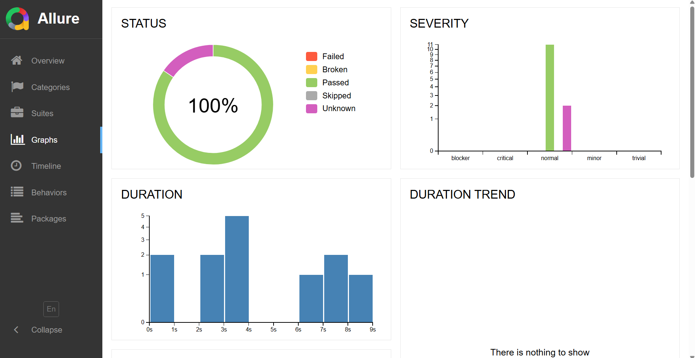

# 📱 Mobile App Automation Framework (Java + Appium + TestNG + Allure)

A robust and scalable test automation framework for Android/iOS mobile applications using **Appium**, **Java**, **TestNG**, and **Allure Reports**.

---

## 🧰 Tech Stack

- **Programming Language**: Java
- **Automation Tool**: Appium
- **Test Framework**: TestNG
- **Reporting**: Allure Reports
- **Build Tool**: Maven
- **Device Support**: Android & iOS (Real or Emulator)
- **CI/CD Ready**: Jenkins/GitHub Actions compatible

---

## 📁 Project Structure
│   
├── src/test/java/  
│ ├── tests/ # TestNG test cases  
│ ├── pages/ # Page Object Models  
│ ├── utils/ # Reusable utility classes  
│ └── base/ # Base setup, Appium driver initialization  
│  
├── src/test/resources/  
│ └── config.properties # Appium & environment configurations  
│  
├── testng.xml # TestNG suite file  
├── pom.xml # Maven dependencies  
└── README.md # Project overview  

## Report

